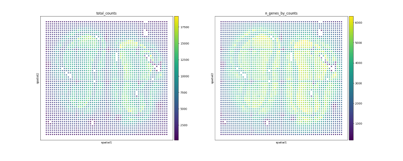
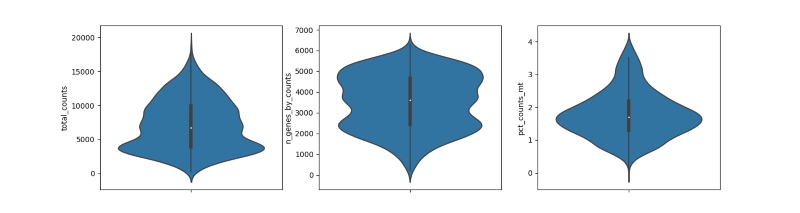
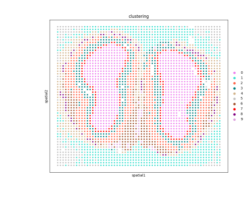
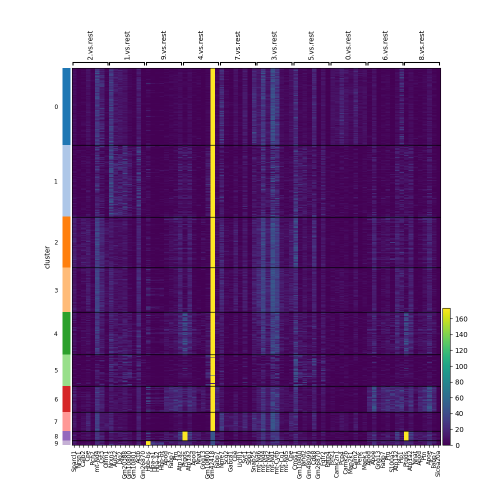
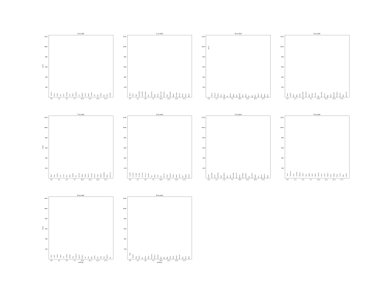

demo
====

以小鼠stereo-seq后整理的空间组学表达矩阵为例，利用stereopy工具对小鼠的空间组学进行数据分析。

数据矩阵格式如下, x,
y分别为基因在组织切片的空间位置，count为基因表达数量。

+----------+-------+-------+---------+
| GeneID   | x     | y     | count   |
+==========+=======+=======+=========+
| Gene1    | 121   | 200   | 2       |
+----------+-------+-------+---------+
| Gene2    | 234   | 300   | 1       |
+----------+-------+-------+---------+

该矩阵作为初始输入，分析流程大概分为如下几步。

1. 数据读取
~~~~~~~~~~~~

.. code:: python

    import stereo as st
    mouse_data_path = './path/to/matrix'
    andata = read_stereo_data(mouse_data_path, bin_size=100)

为了方便处理，将矩阵信息取成andata的格式，andata将数据分成三个模块存储，其详细介绍在
*https://scanpy.readthedocs.io/en/latest/usage-principles.html#anndata*

由于stereo-seq是纳米级别的空间位置测序，每一个位置捕捉到的表达基因数目有限，
可以通过设置bin
size参数，将范围内的位点10\*10（bin\_size=10）合并成一个，适当的bin size能达到单细胞水平的分析效果。

2.预处理
~~~~~~~~~~~~

.. code:: python

    # quality control
    andata = st.preprocess.cal_qc(andata=andata)
    # filter
    st.preprocess.filter_cells(adata=andata, min_gene=200, n_genes_by_counts=3, pct_counts_mt=4, inplace=True)
    # normalize
    st.preprocess.Normalizer(data=andata, method='normalize_total', inplace=True, target_sum=10000).fit()

预处理主要包括质控、过滤和标准化三个部分，返回的都是处理后的andata。

3.空间分布可视化
~~~~~~~~~~~~~~~~~~~~~~~~~~~~~~~~~~~~

.. code:: python

    st.plots.plot_spatial_distribution(andata)
    # plt.savefig('./data/spatial_distribution.png')
    st.plots.plot_violin_distribution(andata)

空间分布散点图，能够展示小鼠的组织切片在空间范围的转录表达大体情况。

小提琴图

4.降维分析
~~~~~~~~~~~~~~~~~~~~~~~~~~

.. code:: python

    dim_reduce = st.tools.DimReduce(andata=andata, method='pca', n_pcs=30, min_variance=0.01, n_iter=250, n_neighbors=10, min_dist=0.3, inplace=False, name='dim_reduce')
    dim_reduce.fit()
    pca_x = dim_reduce.result.x_reduce

5.聚类分析
~~~~~~~~~

.. code:: python

    cluster = st.tools.Clustering(data=andata, method='leiden', outdir=None, dim_reduce_key='dim_reduce', n_neighbors=30, normalize_key='cluster_normalize', normalize_method=None, nor_target_sum=10000, name='clustering')
    cluster.fit()
    st.plots.plot_spatial_cluster(andata, obs_key=['clustering'])

对所有位点进行聚类后，再查看其空间分布情况

6.差异基因分析
~~~~~~~~~~~~~

.. code:: python

    marker = st.tools.FindMarker(data=andata, cluster='clustering', corr_method='bonferroni', method='t-test', name='marker_test')
    marker.fit()
    st.plots.plot_heatmap_maker_genes(andata, marker_uns_key='marker_test', cluster_method='clustering')

可以通过差异分析，找出聚类后每一组的差异基因，观察空间上各类‘细胞’的表达差异。

7.细胞注释
~~~~~~~~~~~~

.. code:: python

    cell_anno = st.tools.CellTypeAnno(adata=andata)
    cell_anno.fit()
    st.plots.plot_degs(andata, key='marker_test')

如果bin size为细胞水平大小，可以通过此分析，对细胞进行注释，注释结果包括细胞的类型