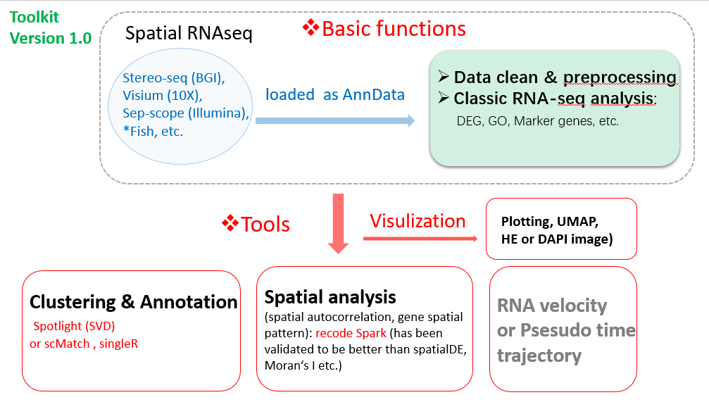

|Downloads| |Docs| |Github|

.. _topics-index:

Stereopy - Spatial transcriptomics analysis in Python
=====================================================

**Stereopy** is a tool for the analysis and visualization of spatial transcriptomics data, such as stereo-seq data.
It provides a series of analysis of spatial omics, and will be added to the tissue image related analysis later.

.. toctree::
   :caption: General
   :maxdepth: 2

   General/Installation
   api/index

.. toctree::
   :caption: Tutorials
   :maxdepth: 2

   Tutorials/quick_start
   Tutorials/Demo

.. |Docs| image:: https://img.shields.io/static/v1?label=docs&message=streopy&color=green
    :target: https://github.com/BGIResearch/stereopy
    :alt: Documentation

.. |Github| image:: https://img.shields.io/github/stars/BGIResearch/stereopy?logo=GitHub&color=yellow
    :target: https://github.com/BGIResearch/stereopy
    :alt: Github

.. |Downloads| image:: https://img.shields.io/static/v1?label=download&message=github&color=blue
    :target: https://github.com/BGIResearch/stereopy
    :alt: Downloads
