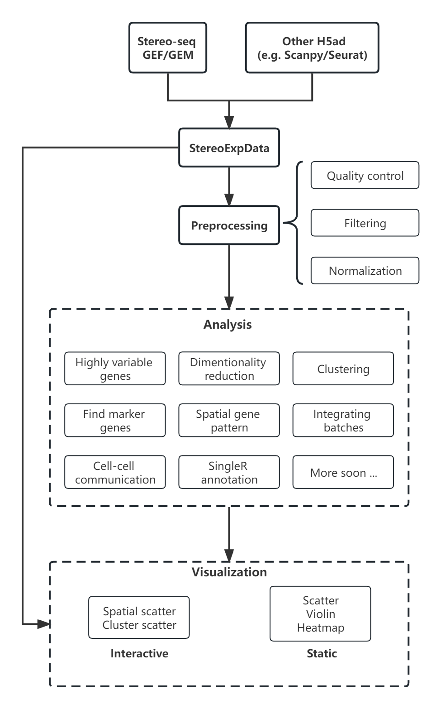

.. Stereopy manual documentation master file, created by
   sphinx-quickstart on Mon Nov 21 18:07:00 2022.
   You can adapt this file completely to your liking, but it should at least
   contain the root `toctree` directive.

.. =====================
.. Document Title
.. =====================

.. First level
.. -----------

.. Second level
.. ++++++++++++

.. Third level
.. ************

.. Fourth level
.. ~~~~~~~~~~~~

|stars| |pypi| |downloads| |docs| 

Stereopy -  Spatial Transcriptomics Analysis in Python
========================================================

**Stereopy** is a fundamental and comprehensive tool for mining and visualization \
based on spatial transcriptomics data, such as Stereo-seq (spatial enhanced resolution omics sequencing) data. \
More analysis will be added here, either from other popular tools or developed by ourselves, to meet diverse requirements. \
Meanwhile, we are still working on the improvement of performance and calculation efficiency.

* Get quickly started by browsing `Usage Principles <https://stereopy.readthedocs.io/en/latest/index.html>`_, `Tutorials <https://stereopy.readthedocs.io/en/latest/Tutorials/Examples.html>`_ or `API <https://stereopy.readthedocs.io/en/latest/api/index.html>`_.
* Open to discuss and provide feedback on `Github <https://github.com/BGIResearch/stereopy>`_.
* Follow changes in `Release Notes <https://stereopy.readthedocs.io/en/latest/release_note.html>`_.

Highlights
-----------

* More suitable for performing downstream analysis of Stereo-seq data.
* Support efficient reading and writing (IO), pre-processing, and standardization of multiple spatial transcriptomics data formats.
* Self-developed Gaussian smoothing model, tissue and cell segmentation algorithm models, and cell correction algorithm.
* Integrate various functions of dimensionality reduction, spatiotemporal clustering, cell clustering, spatial expression pattern analysis, etc.
* Develop interactive visualization functions based on features of Stereo-seq workflow.

Workflow
---------

Latest Additions
------------------

Version 0.12.0
~~~~~~~~~~~~~~
0.12.0 : 2023-04-27

1. Addition of the algorithm of Cell Segmentation V3.0.
2. Addition of method='hotspot' to data.tl.regulatory_network_inference, which takes spatial coordinate information into account to calculate the relative importance between TFs and their target genes.
3. Addition of dpi and width/height setting for visualization, and addition of plotting scale for displaying static plot.
4. Optimized required memory while plotting UMAP embedding via data.plt.umap and cell distribution via data.plt.cells_plotting.
5. Fixed bug that input parameter of var_features_n was invalid, in data.tl.scTransform.
6. Updated requirements.txt.

Version 0.11.0
~~~~~~~~~~~~~~
0.11.0 : 2023-04-04

1. Addition of Cell-cell Communication analysis.
2. Addition of Gene Regulatory Network analysis.
3. Addition of SingleR function for automatic annotation.
4. Addition of `v2` algorithm fast cell correction.
5. Addition of dot plot to display gene-level results.
6. Addition of the sorting function and the limitation of output genes in `data.tl.find_marker_genes`.
7. Added `pct` and `pct_rest` to the output files of marker genes.
8. Addition of the parameter `mean_uni_gt` in `data.tl.filter_genes` to filter genes on average expression.
9. Fixed the bug that `adata.X` to output AnnData was the raw matrix.
10. Fixed the failed compatibility to analysis results from `.h5ad` (version <= 0.9.0).
11. Updated the tissue segmentation algorithm in the module of cell segmentation to avoid the lack of tissue.
12. Reconstructed the manual of Stereopy.
13. Updated requirements.txt.

.. toctree::
    :titlesonly:
    :maxdepth: 2
    :hidden: 

    content/00_Installation
    content/01_Usage_principles
    Tutorials/Cases
    content/03_API
    content/04_Community
    content/05_Contributing
    content/06_Release_notes
    content/07_References

.. |docs| image:: https://img.shields.io/static/v1?label=docs&message=stereopy&color=green
    :target: https://stereopy.readthedocs.io/en/latest/index.html
    :alt: docs

.. |stars| image:: https://img.shields.io/github/stars/BGIResearch/stereopy?logo=GitHub&color=yellow
    :target: https://github.com/BGIResearch/stereopy
    :alt: stars

.. |downloads| image:: https://static.pepy.tech/personalized-badge/stereopy?period=total&units=international_system&left_color=grey&right_color=blue&left_text=downloads
    :target: https://pepy.tech/project/stereopy
    :alt: Downloads

.. |pypi| image:: https://img.shields.io/pypi/v/stereopy
    :target: https://pypi.org/project/stereopy/
    :alt: PyPI

