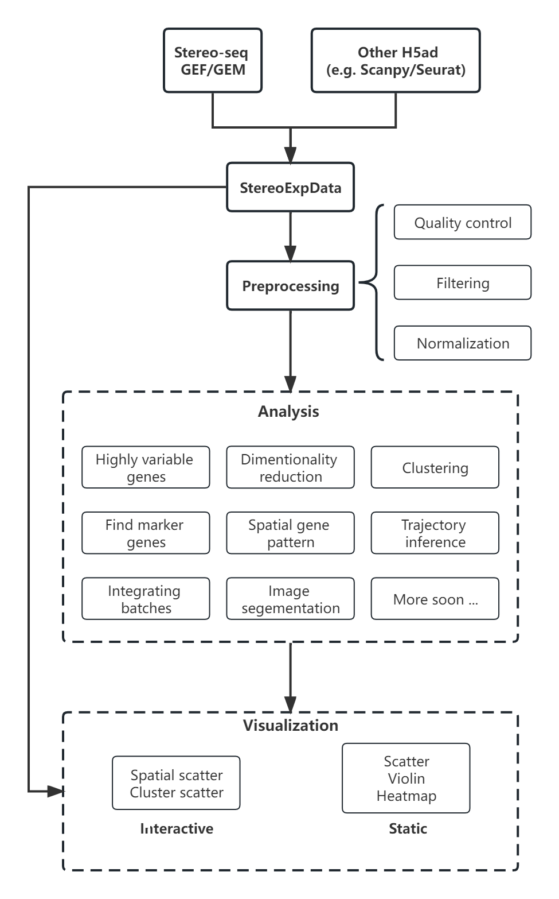

.. Stereopy manual documentation master file, created by
   sphinx-quickstart on Mon Nov 21 18:07:00 2022.
   You can adapt this file completely to your liking, but it should at least
   contain the root `toctree` directive.

.. =====================
.. Document Title
.. =====================

.. First level
.. -----------

.. Second level
.. ++++++++++++

.. Third level
.. ************

.. Fourth level
.. ~~~~~~~~~~~~

|stars| |pypi| |downloads| |docs| 

Stereopy -  Spatial Transcriptomics Analysis in Python
========================================================

**Stereopy** is a fundamental and comprehensive tool for mining and visualization \
based on spatial transcriptomics data, such as Stereo-seq(spatial enhanced resolution omics sequencing) data. \
More analysis will be added here, either from other popular tools or developed by ourselves, to meet diverse requirements. \
Meanwhile we are still working on the improvement of performance and calculation efficiency.

* Get quickly started by browsing **Usage Principles**, **Tutorials** or **API**.
* Open to discuss and provide feedback on **Github**.
* Follow changes in **Release Notes**.

.. 加粗信息需要设置页面跳转和链接跳转（例如usage principles和Github）

Highlights
-----------

* More suitable for performing downstream analysis of Stereo-seq data.
* Support efficient reading and writing(IO), pre-processing, and standardization of multiple spatial transcriptomics data formats.
* Self-developed Gaussian smoothing model, tissue and cell segmentation algorithm models, and cell correction algorithm.
* Integrate various functions of dimensionality reduction, spatiotemporal clustering, cell clustering, spatial expression pattern analysis, etc.
* Develop interactive visualization functions based on features of Stereo-seq workflow.

Workflow
---------

Latest Additions
------------------

Version 0.9.0
~~~~~~~~~~~~~~
0.9.0 : 2023-01-10

1. Resolved cell boundary overlapping issues during cell correction visualization.
2. Addition of manually annotating cells and clusters via command lines or interactive visualization features.
3. Addition of GPU version of UMAP, Neighbors, Leiden, and Louvian.
4. Updated requirements.txt.

Version 0.8.0
~~~~~~~~~~~~~~
0.8.0 : 2022-12-02

1. Reconstructed SCTransform normalization in python.
2. Optimized the efficiency of FAST cell correction.
3. Enabled to read Seurat output H5AD file for further analysis in Stereopy.

.. toctree::
    :maxdepth: 3
    :hidden: 

    content/00_Installation
    content/01_Usage_principles
    Tutorials/Cases
    content/03_API
    content/04_Community
    content/05_Contributing
    content/06_Release_notes
    content/07_References

.. |docs| image:: https://img.shields.io/static/v1?label=docs&message=stereopy&color=green
    :target: https://stereopy.readthedocs.io/en/latest/index.html
    :alt: docs

.. |stars| image:: https://img.shields.io/github/stars/BGIResearch/stereopy?logo=GitHub&color=yellow
    :target: https://github.com/BGIResearch/stereopy
    :alt: stars

.. |downloads| image:: https://static.pepy.tech/personalized-badge/stereopy?period=total&units=international_system&left_color=grey&right_color=blue&left_text=downloads
    :target: https://pepy.tech/project/stereopy
    :alt: Downloads

.. |pypi| image:: https://img.shields.io/pypi/v/stereopy
    :target: https://pypi.org/project/stereopy/
    :alt: PyPI

