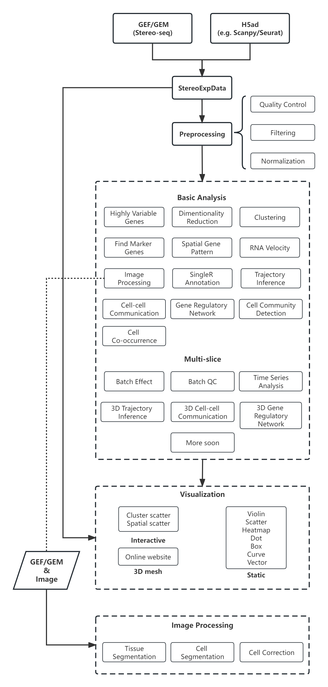

.. Stereopy manual documentation master file, created by
   sphinx-quickstart on Mon Nov 21 18:07:00 2022.
   You can adapt this file completely to your liking, but it should at least
   contain the root `toctree` directive.

.. =====================
.. Document Title
.. =====================

.. First level
.. -----------

.. Second level
.. ++++++++++++

.. Third level
.. ************

.. Fourth level
.. ~~~~~~~~~~~~

|stars| |pypi| |downloads| |docs| 

Stereopy -  Spatial Transcriptomics Analysis in Python
========================================================

**Stereopy** is a fundamental and comprehensive tool for mining and visualization \
based on spatial transcriptomics data, such as Stereo-seq (spatial enhanced resolution omics sequencing) data. \
More analysis will be added here, either from other popular tools or developed by ourselves, to meet diverse requirements. \
Meanwhile, we are still working on the improvement of performance and calculation efficiency.

* Get quickly started by browsing `Usage Principles <https://stereopy.readthedocs.io/en/latest/index.html>`_, `Tutorials <https://stereopy.readthedocs.io/en/latest/Tutorials/Cases.html>`_ or `API <https://stereopy.readthedocs.io/en/latest/content/03_API.html>`_.
* Open to discuss and provide feedback on `Github <https://github.com/STOmics/stereopy>`_.
* Follow changes in `Release Notes <https://stereopy.readthedocs.io/en/latest/content/06_Release_notes.html>`_.

About MSData
--------------
For multi-slice data analysis, we have recently launched a simple-to-use method that can distinguish uni-slice \
and multi-sclie when working on the parallel processings, but the results of two parties can be interacted.

In order to adapt to the new parameters and concepts in MSData analysis, the current version is a Beta one, which means there are \
inevitably a handful of bugs. We sincerely hope to receive your feedback and suggestions for MSData.

Upcoming functions
--------------------
* New algorithm for Batch Effect Correction
* GPU version for SingleR annotation

Highlights
------------

* More suitable for performing downstream analysis of Stereo-seq data.
* Support efficient reading and writing (IO), pre-processing, and standardization of multiple spatial transcriptomics data formats.
* Self-developed Gaussian smoothing model, tissue and cell segmentation algorithm models, and cell correction algorithm.
* Integrate various functions of dimensionality reduction, spatiotemporal clustering, cell clustering, spatial expression pattern analysis, etc.
* Develop interactive visualization functions based on features of Stereo-seq workflow.

Workflow
----------

Latest Additions
------------------

Version 0.14.0b1 (Beta)
~~~~~~~~~~~~~~~~~~~~~~~~~
0.14.0b1 : 2023-9-15

Notice: this Beta version is specifically developed for multi-slice analysis.

Features:

1. Addition of Cell Community Detection (CCD) analysis.
2. Addition of Cell Co-occurrence analysis.
3. Addition of Cellpose in cell segmentation, especially for cell cytoplasm using `model_type='cyto2'`.
4. Addition of circos (`st.plt.ccc_circos_plot`) and sankey (`st.plt.ccc_sankey_plot`) plots in Cell-cell Communication analysis.
5. Addition of volcano (`st.plt.TVG_volcano_plot`) and tree (`st.plt.time_series_tree_plot`) plots in Time Series analysis.
6. Addition of PAGA tree plot, `st.plt.paga_plot`.
7. Addition of visuallization of `st.tl.dendrogram`.
8. Addition of version check using `st.__version__`.
9. Supported obtain subset from a data object, using clustering output, by `st.tl.filter_by_clusters`.
10. Supported filtering data using hvgs, by `st.tl.filter_by_hvgs`.
11. Supported mapping the clustering result of SquareBin analysis to the same data but in CellBin.
12. Supported writing annotation information into CGEF file, only clustering result available before.
13. Supported saving images of PNG and PDF formats, in interactive interface.
14. Optimized the function of `st.tl.find_marker_genes`.
15. Optimized the modification of titles in horizontal axis, vertical axis and plot.

BUG Fixes:

1. Fixed the issue that SingleR calculating did not add filtration to the column field when traversing expression matrix, resulting in the subsequent absence of the column index.
2. Fixed the issue that output Seurat h5ad could not be transformed into R format.
3. Fixed the issue that clustering output of Leiden was in wrong data type under the scene of GPU acceleration, leading to errors in subsequent analysis which work on the clustering result.
4. Fixed the issue that clustering result could not be written into GEF file, using `st.io.update_gef`, caused by data type error. From v0.12.1 on, `date.cells.cell_name` has changed from int to string. 

Version 0.13.0b1 (Beta)
~~~~~~~~~~~~~~~~~~~~~~~~~
0.13.0b1 : 2023-07-11

Notice: this Beta version is specifically developed for multi-slice analysis. Major update points are listed below.

1. Addition of 3D Cell-cell Communication.
2. Addition of 3D Gene Regulatory Network.
3. Addition of Trajectory Inference, including PAGA and DPT algorithms.
4. Addition of Batch QC function for evaluation on batch effect.
5. Addition of `st.io.read_h5ad` for improved compatibility with AnnData H5ad, we highly recommend that instead of `st.io.read_ann_h5ad`.
6. Addition of analysis workflow tutorial based on multi-slice data, with assistant parameters `scope` and `mode`.
7. Addition of resetting the image order of multi-slice analysis results.
8. Addition of 3D mesh visualization.
9. Improved the performance of Gaussian Smoothing.

Version 0.12.1
~~~~~~~~~~~~~~
0.12.1 : 2023-06-21

1. Addition of the pretreatment of calculating quality control metrics at the start of `st.tl.filter_genes` and `st.tl.filter_cells`.
2. Fixed the bug that loaded data from GEF file had the same expression matrix but in different row order, through updating gefpy package to v0.6.24.
3. Fixed the bug that `scale.data` had `np.nan` value in `st.tl.sctransform` , caused by data type limitation.
4. Fixed the bug that dot symbol ( '.' ) caused identification error of cluster name in `.csv` output, when doing `st.tl.find_marker_genes`.

.. toctree::
    :titlesonly:
    :maxdepth: 3
    :hidden: 

    content/00_Installation
    content/01_Usage_principles
    Tutorials(Multi-sample)/Multi_sample
    Tutorials/index
    content/03_API
    content/04_Community
    content/05_Contributing
    content/06_Release_notes
    content/07_References

.. |docs| image:: https://img.shields.io/static/v1?label=docs&message=stereopy&color=green
    :target: https://stereopy.readthedocs.io/en/latest/index.html
    :alt: docs

.. |stars| image:: https://img.shields.io/github/stars/STOmics/stereopy?logo=GitHub&color=yellow
    :target: https://github.com/STOmics/stereopy
    :alt: stars

.. |downloads| image:: https://static.pepy.tech/personalized-badge/stereopy?period=total&units=international_system&left_color=grey&right_color=blue&left_text=downloads
    :target: https://pepy.tech/project/stereopy
    :alt: Downloads

.. |pypi| image:: https://img.shields.io/pypi/v/stereopy
    :target: https://pypi.org/project/stereopy/
    :alt: PyPI

