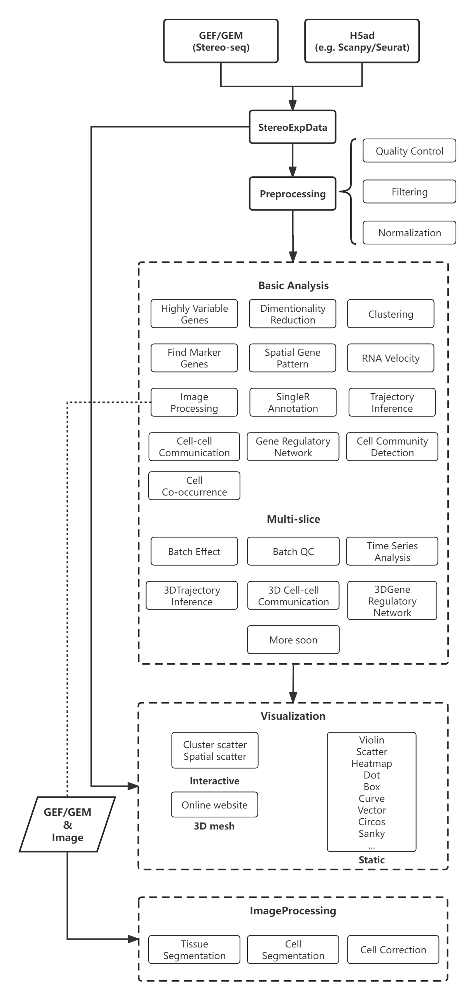

.. Stereopy manual documentation master file, created by
   sphinx-quickstart on Mon Nov 21 18:07:00 2022.
   You can adapt this file completely to your liking, but it should at least
   contain the root `toctree` directive.

.. =====================
.. Document Title
.. =====================

.. First level
.. -----------

.. Second level
.. ++++++++++++

.. Third level
.. ************

.. Fourth level
.. ~~~~~~~~~~~~

|stars| |pypi| |downloads| |docs| 

Stereopy -  Spatial Transcriptomics Analysis in Python
========================================================

**Stereopy** is a fundamental and comprehensive tool for mining and visualization \
based on spatial transcriptomics data, such as Stereo-seq (spatial enhanced resolution omics sequencing) data. \
More analysis will be added here, either from other popular tools or developed by ourselves, to meet diverse requirements. \
Meanwhile, we are still working on the improvement of performance and calculation efficiency.

* Get quickly started by browsing `Usage Principles <https://stereopy.readthedocs.io/en/latest/index.html>`_, `Tutorials <https://stereopy.readthedocs.io/en/latest/Tutorials/Cases.html>`_ or `API <https://stereopy.readthedocs.io/en/latest/content/03_API.html>`_.
* Open to discuss and provide feedback on `Github <https://github.com/STOmics/stereopy>`_.
* Follow changes in `Release Notes <https://stereopy.readthedocs.io/en/latest/content/06_Release_notes.html>`_.

News
--------------
The paper of Stereopy has been pre-printed on bioRxiv!

`Stereopy: modeling comparative and spatiotemporal cellular heterogeneity via multi-sample spatial transcriptomics <https://doi.org/10.1101/2023.12.04.569485>`_.

Upcoming functions
--------------------
* Batch Effect removal funciton
* Lasso expression matrix and image simultaneously
* ...

Highlights
------------

* More suitable for performing downstream analysis of Stereo-seq data.
* Support efficient reading and writing (IO), pre-processing, and standardization of multiple spatial transcriptomics data formats.
* Self-developed Gaussian smoothing model, tissue and cell segmentation algorithm models, and cell correction algorithm.
* Integrate various functions of dimensionality reduction, spatiotemporal clustering, cell clustering, spatial expression pattern analysis, etc.
* Develop interactive visualization functions based on features of Stereo-seq workflow.

Workflow
----------

Latest Additions
------------------

Version 1.2.0
~~~~~~~~~~~~~~~~~~~
1.2.0 : 2024-03-30

Features:

1. `st.io.read_gem` and `st.io.read_gef` support expression matrix files with geneID information.
2. Analysis results of `find_marker_genes`  will be saved into the output AnnData h5ad.
3. Upgraded tissue segmentation algorithm.
4. Addition of `st.tl.adjusted_rand_score` to calculate the adjusted Rand coefficient between two clusters.
5. Addition of `st.tl.silhouette_score` to calculate the average silhouette coefficient of a cluster.
6. `h5ad2rds.R` is compatible with AnnData version > 0.7.5, to convert from h5ad to rds files.
7. Addition of the clustering category labels to the graph of `st.plt.paga_compare`.

BUG Fixes:

1. Fixed the error of high memory consumption when converting `X.raw` into AnnData.

Version 1.1.0
~~~~~~~~~~~~~~
1.1.0 : 2024-01-17

Features:

1. Reconstructed `st.plt.violin` visualizing function which is now not only applied to display QC indicators;
2. `ins.export_high_res_area` can handle expression matrix and image simultaneously, to lasso region of interest and corresponding sub-image.
3. Interactive visualizing `st.plt.cells_plotting` supported displaying expression heatmap and spatial distribution of a single gene.
4. When input GEF and GEM at cell level, information of DNB count and cell area would be added into `cells` / `obs`, and cell border would be added into `cells_matrix` / `obsm`.

BUG Fixes:

1. `slideio` package removed historical versions, resulting in an installation failure.
2. Calculating error when performing `ms_data.tl.batch_qc`, due to abnormal `os.getlogin`.
3. `st.plt.paga_time_series_plot` indicated that the image was too large to draw, due to unprocessed boundary values when computing median.

Version 1.0.0
~~~~~~~~~~~~~~
1.0.0 : 2023-12-04

Features:

1. Addition of GPU acceleration on SinlgeR for large-volume data, and optimized calculating based on CPU version.
2. Addition of `st.plt.elbow` to visualize PCA result, for appropriate number of pcs.
3. Addition of color, max, min setting for colorbar, when plotting heatmap.
4. Addition of cell segmentation of `Deep Learning Model V1_Pro`, which is improved based on `V1`.
5. Supplemented parameters of `st.plt.auc_heatmap` and `st.plt.auc_heatmap_by_group`, full access to `seaborn.clustermap`;
6. Addition of thread and seed setting in `st.tl.umap`, of which the default method have been changed to single thread with the sacrifice of computational efficiency to ensure reproducibility of results. More in https://umap-learn.readthedocs.io/en/latest/reproducibility.html.
7. Modification of computing method of bin coordinates when reading GEM, consistent with GEF.
8. Optimized `st.io.stereo_to_anndata` for efficient format conversion.
9. Renamed `st.tl.spatial_alignment` function as `st.tl.paste`.
10. `export_high_res_area` removed parameter `cgef`.

BUG Fixes:

1. Occasional square-hollowing area in `Deep Learning Model V3` of cell segmentation processing.
2. `st.tl.annotation` could not set two or more clusters as a same name. 
3. The data object `ins.selected_exp_data` obtained from `st.plt.interact_spatial_scatter` could not be used for subsequent analysis.
4. Part of data was missing when performed `st.plt.interact_spatial_scatter` to output high-resolution matrix in GEF format.
5. Some files met reading error, led by no default setting of `bin_type` and `bin_size` in `st.io.read_h5ms`.
6. Error in Batch QC calculation due to data type problem.
7. There is NaN in Cell Community Detection output after threshold filtering, resulting in a calculating error when performed Find marker genes based on it.
8. `st.plt.paga_time_series_plot` indicated the image is too large to draw, leading to graph overlap, due to the limitation of matplotlib package.

.. toctree::
    :titlesonly:
    :maxdepth: 3
    :hidden: 

    content/00_Installation
    content/01_Usage_principles
    Tutorials(Multi-sample)/Multi_sample
    Tutorials/index
    content/03_API
    content/04_Community
    content/05_Contributing
    content/06_Release_notes
    content/07_References

.. |docs| image:: https://img.shields.io/static/v1?label=docs&message=stereopy&color=green
    :target: https://stereopy.readthedocs.io/en/latest/index.html
    :alt: docs

.. |stars| image:: https://img.shields.io/github/stars/STOmics/stereopy?logo=GitHub&color=yellow
    :target: https://github.com/STOmics/stereopy
    :alt: stars

.. |downloads| image:: https://static.pepy.tech/personalized-badge/stereopy?period=total&units=international_system&left_color=grey&right_color=blue&left_text=downloads
    :target: https://pepy.tech/project/stereopy
    :alt: Downloads

.. |pypi| image:: https://img.shields.io/pypi/v/stereopy
    :target: https://pypi.org/project/stereopy/
    :alt: PyPI

