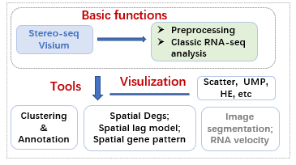

|Downloads| |Docs| |Github|

.. _topics-index:

Stereopy - Spatial transcriptomics analysis in Python
=====================================================

**Stereopy** is a tool for the analysis and visualization of spatial transcriptomics data, such as stereo-seq data.
It provides a series of analysis of spatial omics, and will be added to the tissue image related analysis later.

StereoExpData
-------------

StereoExpData is designed for express matrix of spatial omics. It contains four important attributes, which record gene,
cell, expression matrix and location information respectively. The express matrix. The expression matrix supports both
sparse data and dense data.

Highlights of stereopy
----------------------

pending upgrade.

.. toctree::
   :caption: General
   :maxdepth: 2

   General/Installation
   api/index

.. toctree::
   :caption: Tutorials
   :maxdepth: 2

   Tutorials/quick_start
   Tutorials/Examples
   release_note

.. |Docs| image:: https://img.shields.io/static/v1?label=docs&message=stereopy&color=green
    :target: https://github.com/BGIResearch/stereopy
    :alt: Documentation

.. |Github| image:: https://img.shields.io/github/stars/BGIResearch/stereopy?logo=GitHub&color=yellow
    :target: https://github.com/BGIResearch/stereopy
    :alt: Github

.. |Downloads| image:: https://img.shields.io/static/v1?label=download&message=github&color=blue
    :target: https://github.com/BGIResearch/stereopy
    :alt: Downloads
